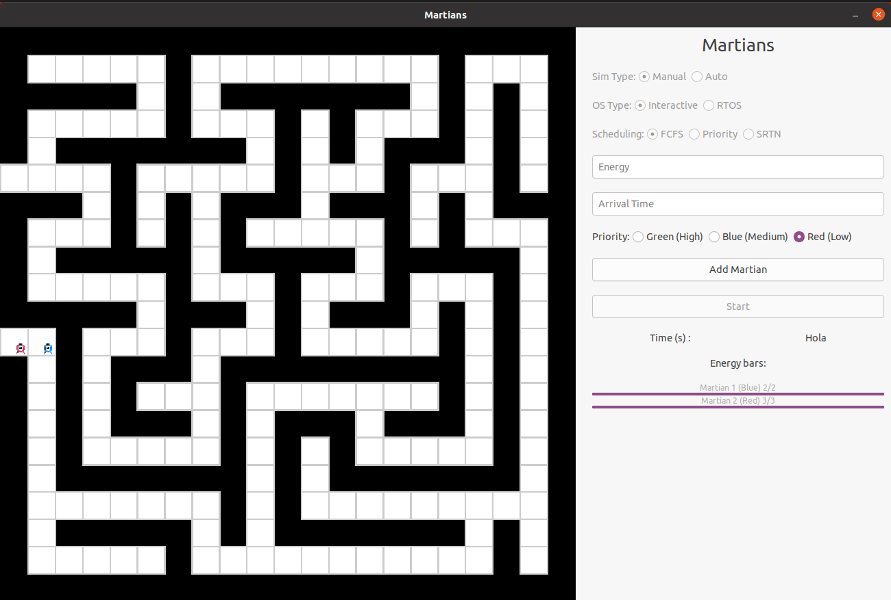
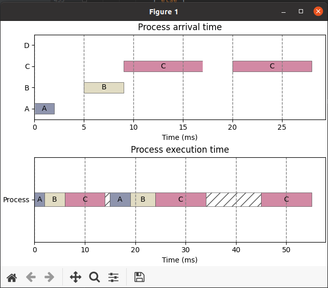

# Martians

**Martians** is a simulation of a process scheduling system, following scheduler theory of simple operating systems. It features different operation modes.

## Photos 📷

Main UI                       
:------------------------------:|
  | 

### Prerequisites 👓

Software you need to install to run this project:

```
C version 23
C libraries: SDL2, SDL2 Image, pthread, gtk+ 3.0
Python 3.8 or higher (recommended)
Python libraries: numpy, matplotlib, pandas
```

### Compiling 💻

Run the included **MakeFile** with the default make command. Make sure to install all dependencies, especially SDL2 and SDL2 image, which can sometimes be tricky to configure.

## Authors 👨🏻‍💻

* **Brayan Leon** - *Report Developer* - [Braalfa](https://github.com/Braalfa)
* **Brayan Leon** - *Logic Developer* - [brayan156](https://github.com/brayan156)
* **Alejandro Ibarra** - *Developer & Designer* - [AlejandroIbarraC](https://github.com/AlejandroIbarraC)
* **Jesus Yamir Sandoval** - *Developer* - [shuzz22260427](https://github.com/shuzz22260427)

## License 📄

This project is licensed under the MIT License - see the [LICENSE.md](LICENSE.md) file for details

## Acknowledgments 📎

* Costa Rica Institute of Technology
* Kevin Cordero - [kevinscorzu](https://github.com/kevinscorzu)

<p align="center">This project was made with academical purposes. 2022</p
```

